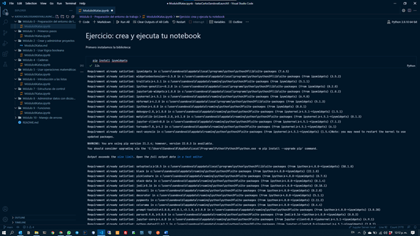
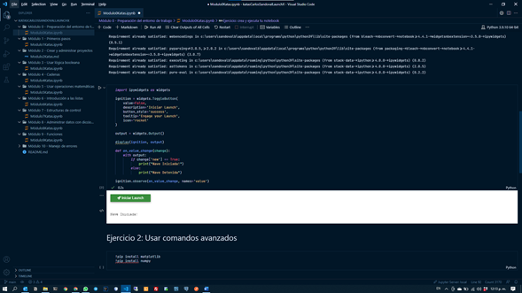
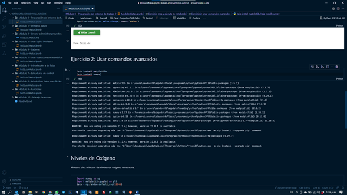
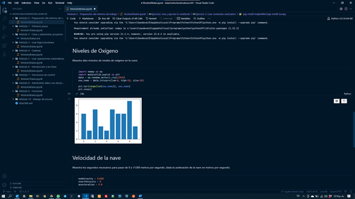
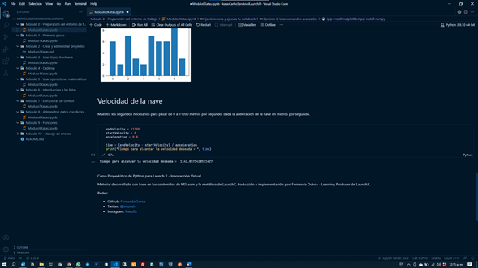

# Evidencia de actividad

En esta actividad preparamos nuestro entorno de trabajo utilizando notebook que sirven para ejecutar bloques de código y agregar áreas de documentación para explicar el código en sí. Agregue evidencia de esta actividad ya que, en la documentación y kata, venia el desarrollo como tal para ejecutar comandos de instalación y código en Python, por lo que muestro en imagen la salida de su ejecución.

1. Instalación de la biblioteca `ipywidgets`.

   
2. Creación del botón en el notebook con la funcionalidad de mostrar un mensaje“Nave Iniciada”o“Nave Detenida" al ser presionado.

   
3. Instalación de las bibliotecas `Matplotlib` y `Numpy`, que nos ayudan a crear tablas y gráficos en Python.

   
4. Mostramos en una grafica diez minutos de niveles de oxigeno en la nave.

   
5. Calculamos los segundos necesarios para pasar de 0 a 11200 metros por segundo, dada la aceleración de la nave en metros por segundo.

   
