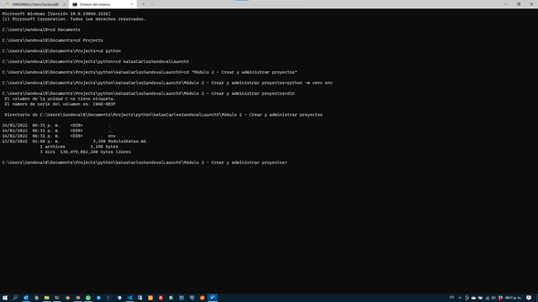
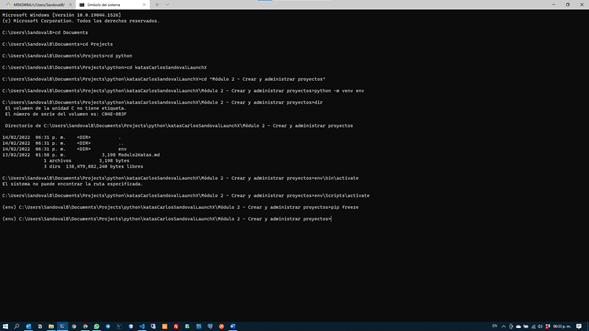
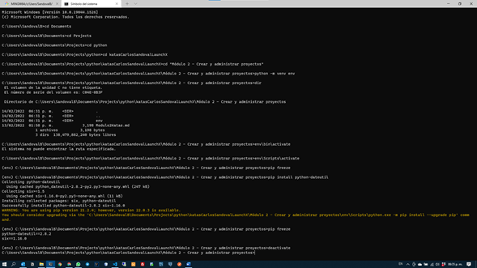

# Evidencia de actividad

En esta actividad creamos un proyecto python de forma aislada, usando un entorno virtual.

1. Creamos nuestro entorno virtual mediante `python -m venv env`

   
2. Ejecutamos el siguiente comando `env\Scripts\activate` para habilitar nuestro entorno virtual y aislando nuestro proyecto del resto de nuestro equipo

   
3. Validamos las bibliotecas instaladas en nuestro entorno virtual con el comando `pip freeze`. En este caso no encontramos ninguna

   
4. Instalamos una biblioteca y volvemos a validar las bibliotecas instaladas. En este caso ya veremos una biblioteca instalada

   
5. Desactivamos nuestro entorno virtual con `deactivate`

   
